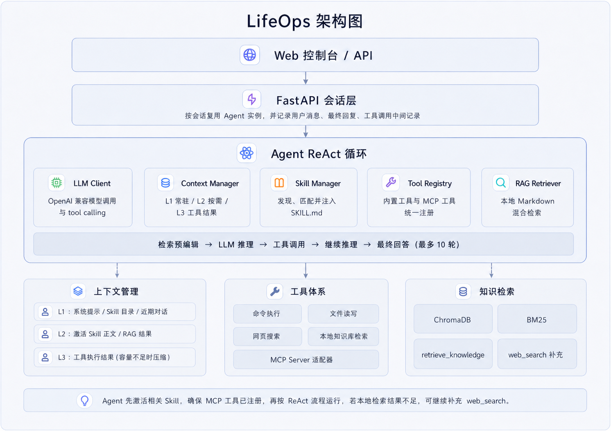
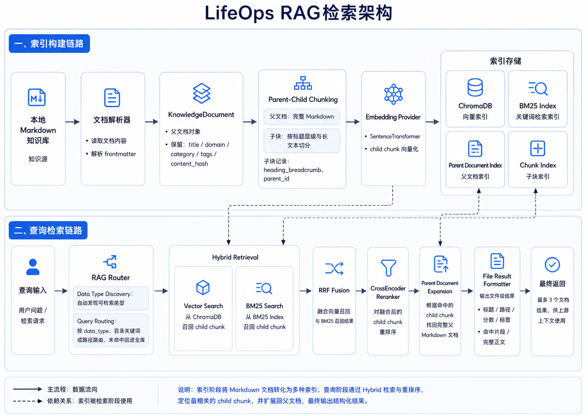
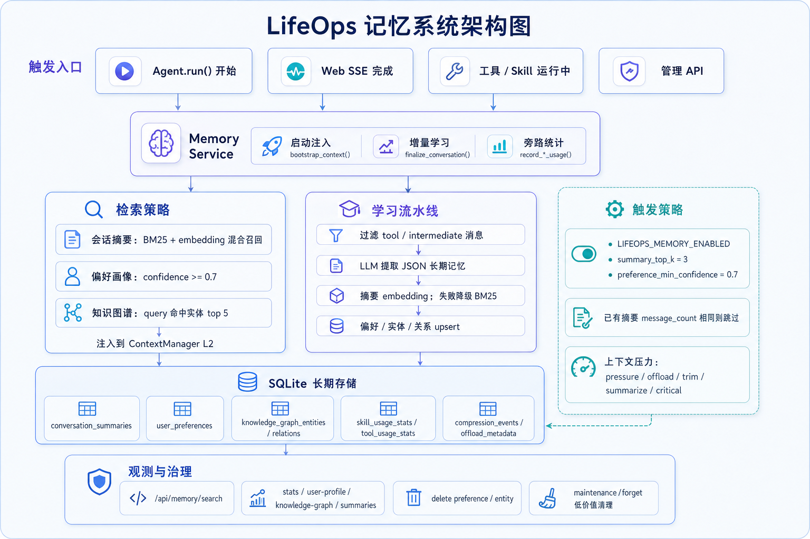
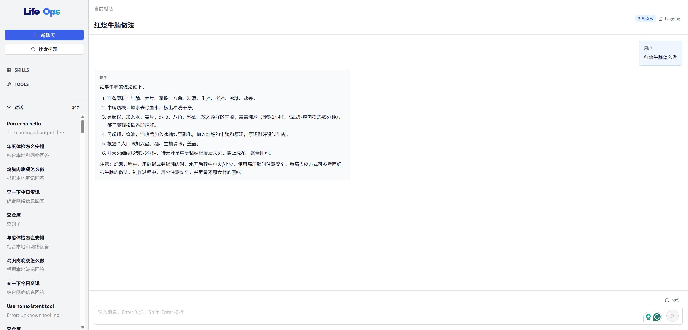
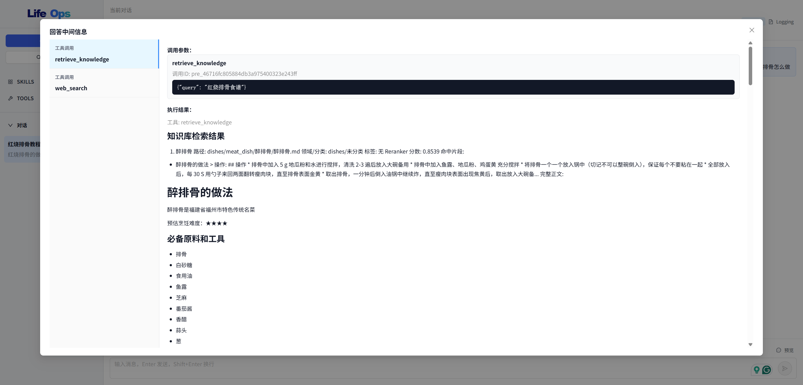

<div align="center">

 

**AI 驱动的生活助手智能体**

[](https://python.org)
[](https://github.com/astral-sh/uv)
[](https://docs.astral.sh/ruff/)

[功能亮点](#功能亮点) · [Web 控制台](#web-控制台) · [智能体能力](#智能体能力) · [快速开始](#快速开始) · [项目结构](#项目结构)

</div>

---

LifeOps 是一个本地优先的 AI 生活助手智能体。它把流式对话、工具调用、Skill 编排、长期记忆、本地 Markdown RAG 和 MCP 工具整合进一个 Web 控制台，让你可以围绕自己的资料、偏好和工作流持续协作。


## 功能亮点

- **流式 AI 对话**：后端通过 SSE 逐 token 返回，前端实时渲染回复，主消息流只保留用户输入和最终回答。
- **本地 Web 控制台**：React + Ant Design 控制台提供聊天、历史、Skill、工具、记忆和日志入口。
- **会话历史管理**：本地保存会话消息和中文短标题，支持按标题搜索、查看详情和删除会话。
- **工具调用 Logging**：工具调用、工具结果和中间信息进入独立 Logging 弹窗，不打断对话阅读。
- **Skill 工作流**：自动发现项目级和用户级 Skill，可在控制台查看元数据，也可直接新增项目级 Skill。
- **工具统一展示**：内置工具和 MCP Server 工具使用同一套工具注册与展示模型，控制台可按 `TOOL` / `MCP` 切换查看。
- **长期记忆**：持续学习会话摘要、用户偏好和知识图谱，并提供记忆搜索、偏好删除、实体删除和低价值记忆清理能力。
- **RAG**：索引本地 Markdown 知识库，混合向量检索、BM25、RRF 与 reranker，让回答能引用你的本地资料。

## 智能体



### ReAct 推理与工具执行

每次输入都会进入 Agent 调度器。Agent 会先加载必要上下文和相关 Skill，再按“检索预编排 → LLM 推理 → 工具调用 → 继续推理 → 最终回答”的流程迭代运行，最多 10 轮。

工具结果不会简单拼接到回答里，而是进入上下文管理器和历史记录。这样模型可以基于真实执行结果继续推理，前端也能完整展示调用轨迹。

### 分层上下文

上下文分为三层：

- `L1`：系统提示、Skill 目录和近期对话，始终保留在上下文中
- `L2`：已激活 Skill 正文、RAG 命中结果和高相关长期记忆
- `L3`：工具执行结果和其他中间产物，压力升高时会卸载、修剪或摘要压缩

这种分层让 LifeOps 可以在长会话中保留稳定身份、近期任务、个人偏好和必要证据，同时控制工具结果带来的上下文膨胀。

### RAG



RAG 系统会把本地 Markdown 知识库索引到 ChromaDB 与 BM25。回答前，Agent 会判断是否需要调用 `retrieve_knowledge`，并根据问题路由到合适的数据目录；本地资料不足时，仍可继续补充网页搜索。

返回结果按父 Markdown 文件聚合，并保留证据片段。Markdown 中的本地图片会通过只读资源接口安全展示在前端消息里。

### 记忆管理

LifeOps 会把跨会话信息写入本地 SQLite，包括会话摘要、用户偏好、知识图谱实体与关系、工具/Skill 使用统计和上下文压缩事件。




## Web 控制台

LifeOps 的主要入口是本地 Web 控制台。后端由 FastAPI 提供会话、聊天、Skill、工具、记忆和 RAG 资源接口；前端通过 SSE 接收流式回答和工具事件。


### 对话与历史

聊天界面固定在视口内，侧边栏用于新建对话、搜索标题和切换历史会话。新会话完成后会自动生成中文短标题；已有会话如果缺少标题，也会在加载或继续对话时补齐。

主消息流专注于最终对话内容。工具调用记录、检索预编排、执行结果和其他中间信息会归档到 Logging 弹窗里，便于需要排查时查看，也避免工具细节淹没最终回答。



### Skills

`SKILLS` 页面展示当前发现的 Skill 名称、描述和来源。LifeOps 会扫描项目级 `.lifeops/skills/` 与用户级 `~/.lifeops/skills/`，并在对话中根据显式 `$skill-name` 或隐式语义匹配按需激活。

控制台也支持通过刷新按钮旁的加号新增项目级 Skill，保存为 `.lifeops/skills/<name>/SKILL.md`，适合把稳定的个人流程沉淀成可复用能力。

### Tools 与 MCP

`TOOLS` 页面默认展示内置工具，包括命令执行、文件读取、文件编辑、网页搜索和本地知识库检索。切换到 `MCP` 后，可以按 Server 展开查看已连接 MCP 工具及参数。

Agent 运行时不需要区分工具来源。内置工具和 MCP 工具都会注册到统一工具表中，由模型按任务需要选择调用，执行结果再写入上下文和 Logging。


## 快速开始

```bash
uv sync
export LLM_API_KEY=your-key-here
uv run lifeops-web
```

另开一个终端启动前端：

```bash
cd web
npm install
npm run dev
```

默认后端地址为 `http://127.0.0.1:8081`，前端地址为 `http://127.0.0.1:5173`。

常用开发命令：

```bash
uv run pytest tests/ -v
uv run ruff check src/ tests/

cd web
npm run build
```

如需重建本地 Markdown RAG 索引：

```bash
uv run python -m lifeops.rag.index --rebuild
```

## 项目结构

```text
lifeops/
├── src/lifeops/
│   ├── agent.py                 # Agent 核心调度器
│   ├── history.py               # 本地会话历史
│   ├── core/                    # 配置与分层上下文
│   ├── llm/                     # OpenAI 兼容 LLM 客户端
│   ├── memory/                  # 长期记忆、偏好和知识图谱
│   ├── rag/                     # Markdown RAG 索引与检索
│   ├── skills/                  # Skill 发现、匹配和加载
│   ├── tools/                   # 内置工具与 MCP 适配
│   └── web/                     # FastAPI 本地 Web API
├── web/                         # React + Vite Web 控制台
├── tests/                       # pytest 测试套件
├── assets/                      # README Logo 与截图素材
└── .lifeops/                    # 本地 Skill、知识库、历史和索引数据
```

## Star History

<a href="https://www.star-history.com/?repos=DarkFanta3y%2Flifeops&type=date&logscale=&legend=top-left">
 <picture>
   <source media="(prefers-color-scheme: dark)" srcset="https://api.star-history.com/chart?repos=DarkFanta3y/lifeops&type=date&theme=dark&logscale&legend=top-left" />
   <source media="(prefers-color-scheme: light)" srcset="https://api.star-history.com/chart?repos=DarkFanta3y/lifeops&type=date&logscale&legend=top-left" />
   
 </picture>
</a>

## License

MIT
