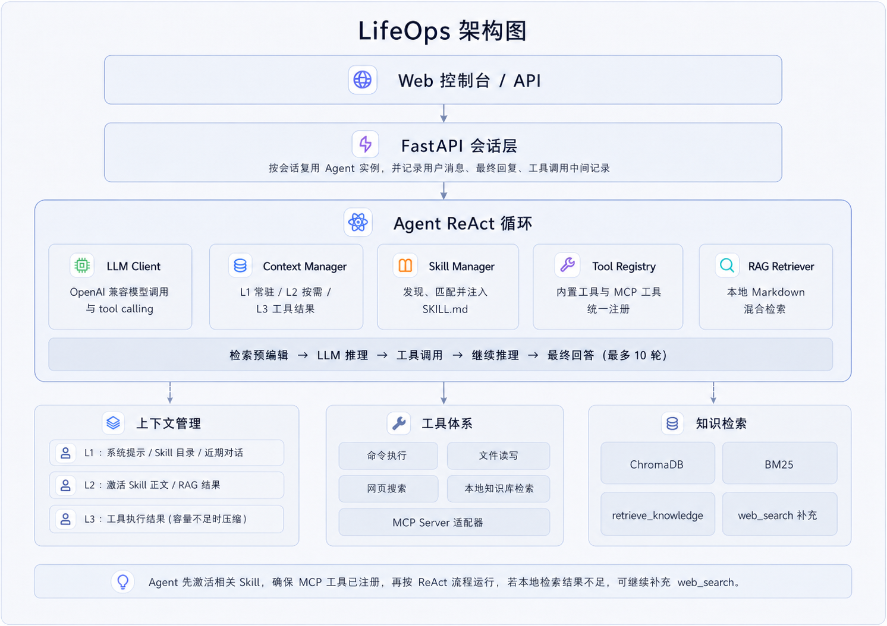
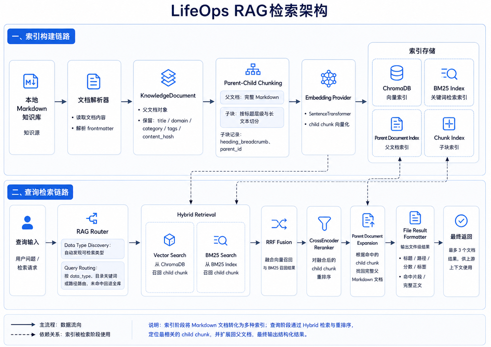
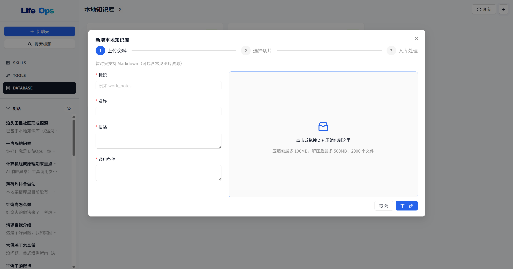
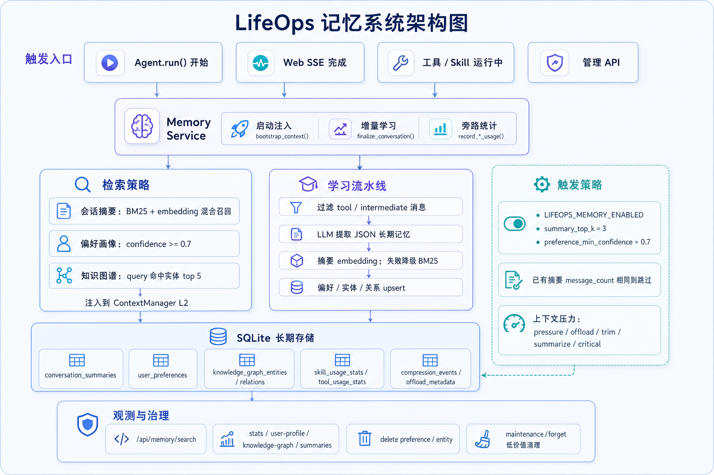
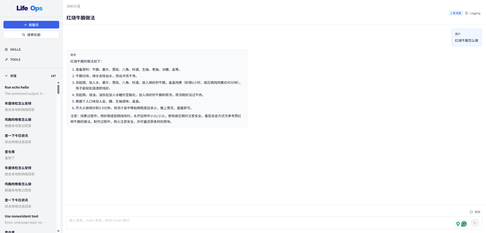
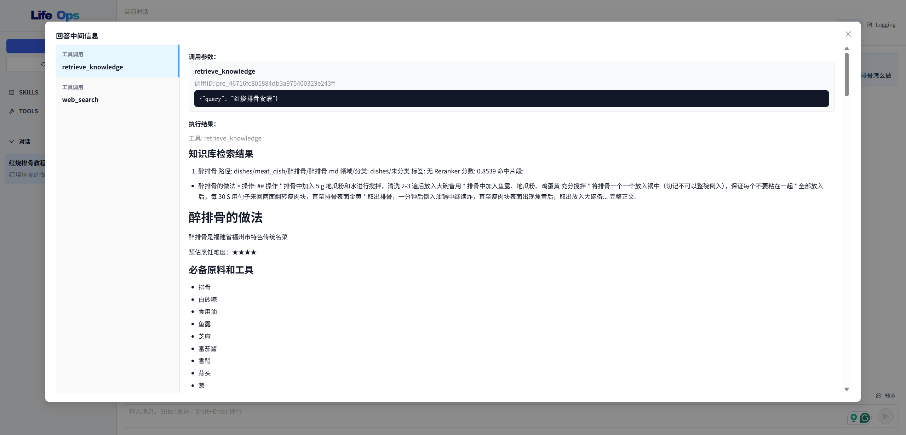

<div align="center">

 

**AI 驱动的生活助手智能体**

[](https://python.org)
[](https://github.com/astral-sh/uv)
[](https://docs.astral.sh/ruff/)

[功能亮点](#功能亮点) · [Web 控制台](#web-控制台) · [智能体能力](#智能体能力) · [快速开始](#快速开始) · [项目结构](#项目结构)

</div>

---

LifeOps 是一个本地优先的 AI 生活助手智能体。它把流式对话、工具调用、Skill 编排、长期记忆、本地 Markdown RAG 和 MCP 工具整合进一个 Web 控制台，让你可以围绕自己的资料、偏好和工作流持续协作。


## 功能亮点

- **流式 AI 对话**：后端通过 SSE 逐 token 返回，前端实时渲染回复；LLM 流式工具参数到齐前会先发送安全预热事件，主消息流只保留用户输入和最终回答，并兼容需要回传 `reasoning_content` 的思考模式模型。
- **本地 Web 控制台**：React + Ant Design 控制台提供聊天、历史、Skill、工具、记忆和日志入口。
- **会话历史管理**：本地保存会话消息和中文短标题，支持按标题搜索、查看详情和删除会话。
- **工具调用 Logging**：工具调用、工具结果和中间信息进入独立 Logging 弹窗，不打断对话阅读。
- **Skill 工作流**：自动发现项目级和用户级 Skill，可在控制台查看元数据，也可直接新增项目级 Skill。
- **工具统一展示**：内置工具和 MCP Server 工具使用同一套工具注册与展示模型，控制台可按 `TOOL` / `MCP` 切换查看。
- **长期记忆**：持续学习会话摘要、用户偏好和知识图谱，并提供记忆搜索、偏好删除、实体删除和低价值记忆清理能力。
- **RAG**：索引本地 Markdown 知识库，混合向量检索、BM25、RRF 与 reranker，让回答能引用你的本地资料。
- **本地知识库管理**：在 DATABASE 页面通过三步向导上传 ZIP，浏览解压目录、预览固定大小或按标题切片，并在后台建立向量与 BM25 索引；完成后重启 LifeOps 加载新知识库。
- **生产级运行时**：每次请求生成 `run_id`，记录结构化 trace、工具策略决策、失败分类和离线 runtime eval，便于审计与回归测试。

## 智能体



### ReAct 推理与工具执行

每次输入都会进入 Agent 调度器。Agent 会先加载必要上下文和相关 Skill，再按“LLM 推理 → 执行工具 → 观察结果 → 继续行动或显式完成”的流程迭代运行，默认最多 50 轮（`LIFEOPS_AGENT_MAX_ITERATIONS` 可调）。简单问答可以直接回答；一旦执行过工具，必须调用下一工具或内部 `finish_task`，不能把普通文本直接视为完成。

工具结果不会简单拼接到回答里，而是进入上下文管理器和历史记录。这样模型可以基于真实执行结果重新判断目标是否满足；同一轮里的多个只读工具（`file_read`、`grep`、`glob` 等）会并行执行以加快信息收集，写入类工具每轮至多一个并在观察完已有结果后串行执行，前端也能通过 Runtime Trace 观察完成决策。

LLM 流式输出工具调用时，Agent 会监听工具名和参数增量：识别工具名后只做无副作用预热，参数可解析为 JSON 后补齐参数元数据；真正执行仍必须等完整 tool call 进入现有策略网关和工具执行流程。

如果流式工具参数拼接后不是合法 JSON，且本轮尚未输出用户可见正文或完整工具调用，Agent 只额外调用一次非流式 LLM 作为协议降级；不猜测修复参数、不用空参数执行工具。降级失败时保留结构化错误，已输出正文的流不会重放。

对于智谱、DeepSeek 等要求在后续请求中回传 `reasoning_content` 的思考模式模型，LifeOps 会在后端历史中保留该协议字段并随下一轮 LLM 请求回传，但不会把模型内部思考内容展示到 Web 消息、搜索结果或 Logging 弹窗中。

### Runtime Trace 与工具策略

Web API 会为每次 `/api/chat` 创建独立 `run_id`，并记录 `run_started`、LLM 调用、检索路由、工具请求、工具策略决策、上下文压缩、完成或失败等 trace event。可通过 `GET /api/runs/{run_id}` 查询一次运行的状态和事件，通过 `GET /api/conversations/{conversation_id}/runs` 查看会话下的运行历史。

工具执行前会经过 `ToolPolicyEngine`。只读工具默认允许，高风险 `bash`、文件写入工具和 MCP 工具默认保守处理；危险命令始终直接拒绝。策略给出 `ask` 决策时进入**人工审批闭环**：SSE 流会先发送 `approval_required` 事件（含参数摘要与原因），聊天输入区上方出现审批卡片，可"允许一次 / 总是允许 / 拒绝"；决策通过 `POST /api/approvals/{request_id}` 提交，Agent 在此期间挂起等待，超时（默认 120s）自动按拒绝处理。"总是允许"会持久化到 `.lifeops/tool-policy.json`（bash 按命令前缀记忆，其他工具按 canonical name），下次同类调用直接放行。`LIFEOPS_TOOL_POLICY_PERMISSION_MODE` 支持 `default`（等待审批）/ `accept_edits`（文件编辑自动放行）/ `yolo`（全部放行，危险命令仍拒绝）。`GET /api/tools/policy` 可查看当前策略摘要。

Runtime 还把 LLM 解析失败、工具失败、策略拒绝、RAG 失败和迭代上限等情况分类写入 trace。离线 eval 覆盖普通问答、危险工具拒绝等核心路径，避免后续 prompt、policy 或 memory 改动破坏基础可靠性。

Runtime 相关配置默认开启：

```bash
LIFEOPS_RUNTIME_ENABLED=true
LIFEOPS_RUNTIME_TRACE_MAX_PAYLOAD_CHARS=12000
LIFEOPS_TOOL_POLICY_MODE=balanced
LIFEOPS_TOOL_POLICY_PATH=.lifeops/tool-policy.json
LIFEOPS_TOOL_POLICY_PERMISSION_MODE=default
LIFEOPS_TOOL_POLICY_APPROVAL_TIMEOUT_SECONDS=120
```

运行后可直接查询：

```bash
curl http://127.0.0.1:8081/api/runs/<run_id>
curl http://127.0.0.1:8081/api/conversations/<conversation_id>/runs
curl http://127.0.0.1:8081/api/tools/policy
```

### 分层上下文

上下文分为三层：

- `L1`：系统提示、Skill 目录和近期对话，始终保留在上下文中
- `L2`：已激活 Skill 正文、RAG 命中结果和高相关长期记忆
- `L3`：工具执行结果和其他中间产物，压力升高时会卸载、修剪或摘要压缩

这种分层让 LifeOps 可以在长会话中保留稳定身份、近期任务、个人偏好和必要证据，同时控制工具结果带来的上下文膨胀。

### RAG



RAG 系统会把本地 Markdown 知识库索引到 ChromaDB 与 BM25。DATABASE 页面新增知识库时，服务端安全解压 ZIP、展示目录树，并预览首个 Markdown 的切片结果；固定大小支持 150–900 字符，按标题切块时超长章节自动拆分。索引完成后写入完成标识和 SQLite 配置，重启时清理未完成导入并加载已完成知识库；覆盖已有知识库前会要求二次确认，失败时恢复旧目录。删除只删除配置，不删除本地文件或索引文件。主 LLM 需要本地资料时调用唯一公开工具 `retrieve_knowledge`，传入工具描述中的顶级 `source`：`source="recipes"` 检索 `dishes/` 菜谱，`source="islamic_culture"` 检索 `伊斯兰文化知识库/`；工具内部再由 `RAGRouter` 分发到对应 Retriever。

返回结果按父 Markdown 文件聚合，并保留证据片段。Markdown 中的本地图片会通过只读资源接口安全展示在前端消息里。




### 记忆管理

LifeOps 会把跨会话信息写入本地 SQLite，包括会话摘要、用户偏好、知识图谱实体与关系、工具/Skill 使用统计和上下文压缩事件。




## Web 控制台

LifeOps 的主要入口是本地 Web 控制台。后端由 FastAPI 提供会话、聊天、Skill、工具、记忆、RAG 资源和数据源管理接口；前端通过 SSE 接收流式回答和工具事件。


### 对话与历史

聊天界面固定在视口内，侧边栏用于新建对话、搜索标题和切换历史会话。新会话的 `done` 事件会先返回基于首条用户消息的即时标题，真实中文短标题在后台生成并写入历史；已有会话如果缺少标题，也会在继续对话后后台补齐。

主消息流专注于最终对话内容。工具调用记录、检索预编排、执行结果和其他中间信息会归档到 Logging 弹窗里，便于需要排查时查看，也避免工具细节淹没最终回答。

SSE 兼容原有 `token`、`tool_call`、`tool_result` 和 `done` 事件，并新增 `tool_prepare` 与 `skill_prepare` 事件用于调试面板观察预热状态；现有前端可以继续忽略这些新增事件。最终 token 发出后，`done` 会尽快关闭连接，短标题落库和长期记忆学习会通过后台任务继续完成。



### Skills

`SKILLS` 页面展示当前发现的 Skill 名称、描述和来源。LifeOps 按 Agent Skills 标准扫描项目级 `.agents/skills/` 与用户级 `~/.agents/skills/`，每个 Skill 是包含 `SKILL.md` 的独立目录，并在对话中根据显式 `$skill-name` 或隐式语义匹配按需激活。

Skill 系统启用时，Agent 会额外暴露只读低风险内部工具 `activate_skill`。模型可通过该伪工具请求激活目录中的 Skill；流式阶段只预读取并校验 Skill，最终工具执行成功后才把完整 Skill 正文注入 L2 上下文并写入 Skill 使用 trace。

控制台也支持通过刷新按钮旁的加号新增项目级 Skill，保存为 `.agents/skills/<name>/SKILL.md`，支持标准的 `license`、`compatibility`、空格分隔 `allowed-tools` 和 YAML `metadata`。

### Tools 与 MCP

`TOOLS` 页面默认展示内置工具，包括命令执行、文件读取、文件创建/替换/追加、代码搜索（`grep` 正则匹配与 `glob` 文件查找）、网页搜索和本地知识库检索。文件编辑有安全网保护：修改已有文件前必须先用 `file_read` 读过该文件（会话级 `FileEditGuard` 强制），`file_replace` 的 `old_text` 必须在文件中唯一，编辑结果以 unified diff 写入工具结果 metadata 并可在 Logging 弹窗查看。工具参数 schema 会保留 `minLength`、`minimum`、`maximum`、`enum`、`pattern`、`additionalProperties: false` 等约束，便于前端展示和模型调用校验。切换到 `MCP` 后，可以按 Server 展开查看已连接 MCP 工具及参数。

Agent 运行时不需要区分工具来源。内置工具、MCP 工具和内部 Skill 伪工具都会注册到统一工具表中，执行层始终保留完整 registry，执行结果再写入上下文和 Logging。`/api/tools` 仍返回完整工具清单，便于管理和调试。

发送给 LLM 的 `tools` 数组会在每轮请求前动态裁剪到最多 20 个：核心内置工具优先保留，MCP 工具会按用户输入、已激活 Skill、Skill `allowed-tools`、工具名/描述和常见 server 领域词做确定性匹配，只暴露本轮相关的 MCP 工具。这样可以在保留完整 MCP 能力的同时减少模型工具选择噪声。

每轮 LLM 请求还会估算 system、历史消息和工具 schema 的 token 预算，超限时裁剪最旧历史并压缩当前运行中的工具输出；无法安全压缩时返回 `context_error` 并将运行标记为失败。MCP 发送给模型的 function name 只使用合法 wire name（例如 `mcp_github_search_repositories`），策略、日志和路由仍保留 `mcp.github.search_repositories` canonical name。

除了手写 `LIFEOPS_MCP_SERVERS` JSON，LifeOps 也支持 `LIFEOPS_MCP_PRESETS` 启用无需 API Key 的基础 MCP 能力。推荐基础组合是 `context7,playwright,memory,sequential_thinking,filesystem`，分别用于库文档查询、浏览器自动化、本地记忆、结构化推理和受限文件访问。已有同名手写 Server 会优先于预设，不会被覆盖。


## 快速开始

```bash
uv sync
export LLM_API_KEY=your-key-here
uv run lifeops-web
```

另开一个终端启动前端：

```bash
cd web
npm install
npm run dev
```

默认后端地址为 `http://127.0.0.1:8081`，前端地址为 `http://127.0.0.1:5173`。

常用开发命令：

```bash
uv run pytest tests/ -v
uv run pytest tests/evals -v
uv run ruff check src/ tests/

cd web
npm run build
```

如需重建本地 Markdown RAG 索引：

```bash
uv run python -m lifeops.rag.index --rebuild
```

## 项目结构

```text
lifeops/
├── src/lifeops/
│   ├── agent.py                 # Agent 核心调度器
│   ├── history.py               # 本地会话历史
│   ├── core/                    # 配置与分层上下文
│   ├── llm/                     # OpenAI 兼容 LLM 客户端
│   ├── memory/                  # 长期记忆、偏好和知识图谱
│   ├── rag/                     # Markdown RAG 索引与检索
│   ├── runtime/                 # run/trace、工具策略和失败分类
│   ├── skills/                  # Skill 发现、匹配和加载
│   ├── tools/                   # 内置工具与 MCP 适配
│   └── web/                     # FastAPI 本地 Web API
├── web/                         # React + Vite Web 控制台
├── tests/                       # pytest 测试套件
├── assets/                      # README Logo 与截图素材
├── .agents/skills/              # Agent Skills 标准 Skill 目录
└── .lifeops/                    # 本地知识库、历史和索引数据（旧 Skill 备份不再自动读取）
```

## Star History

<a href="https://www.star-history.com/?repos=DarkFanta3y%2Flifeops&type=date&logscale=&legend=top-left">
 <picture>
   <source media="(prefers-color-scheme: dark)" srcset="https://api.star-history.com/chart?repos=DarkFanta3y/lifeops&type=date&theme=dark&logscale&legend=top-left" />
   <source media="(prefers-color-scheme: light)" srcset="https://api.star-history.com/chart?repos=DarkFanta3y/lifeops&type=date&logscale&legend=top-left" />
   
 </picture>
</a>

## License

MIT
